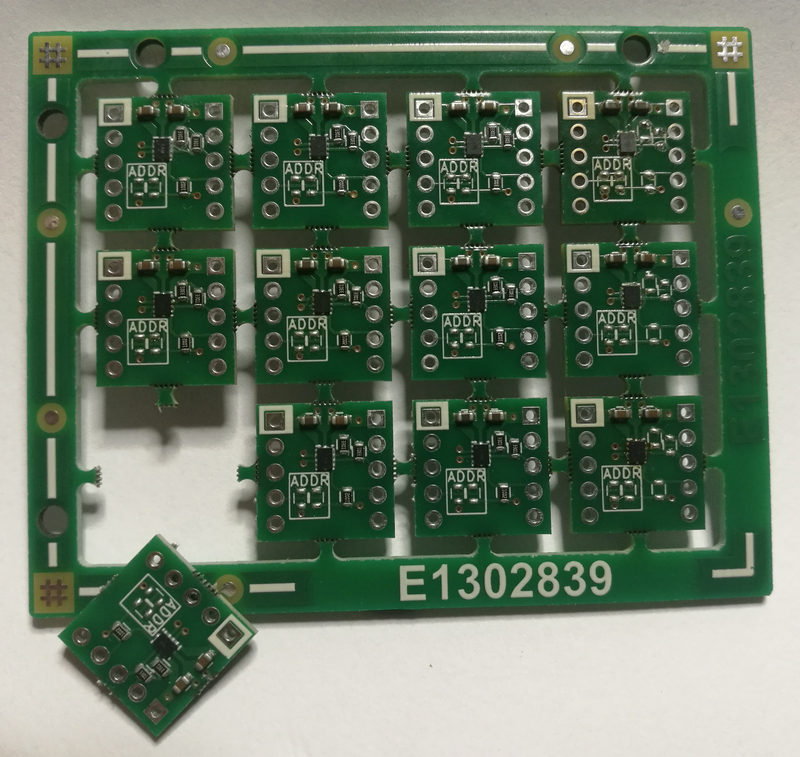
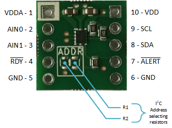

# ADS7142 breakout board (A003.0000017200_DM.ADS7142.BOB)

This is a simple breakout board for
 Texas Instruments ADS7142 (X2QFN) dual-channel, programmable sensor monitor.

[0] - Datasheet: https://www.ti.com/lit/ds/symlink/ads7142.pdf

## Pinout

|#    |Function  |Description   |
|-----|----------|--------------|
|1    |VDDA      |Analog supply input. See AVDD in ref [0]         |
|2    |AIN0      |Channel 0 analog signal input, or positive analog signal input. See AINP/AIN0 in ref [0] |
|3    |AIN1      |Channel 1 analog signal input, or negative analog signal input. See AINM/AIN1 in ref [0] |
|4    |RDY       |See BUSY/RDY in ref [0]                          |
|5    |GND       |Ground for power supply                          |
|6    |GND       |Ground for power supply                          |
|7    |ALERT     |See ALERT in ref [0]                             |
|8    |SDA       |Serial data in/out. See SDA in ref [0]           |
|9    |SCL       |Serial clock. See SCL in ref [0]                 |
|10   |VDD       |Digital I/O supply voltage. See DVDD in ref [0]  |

## Configuration

To select the device address on I2C bus, populate the proper resistor values (R1, R2) as described in the datasheet. See chapter *7.3.6 I2C Address Selector* in [0]